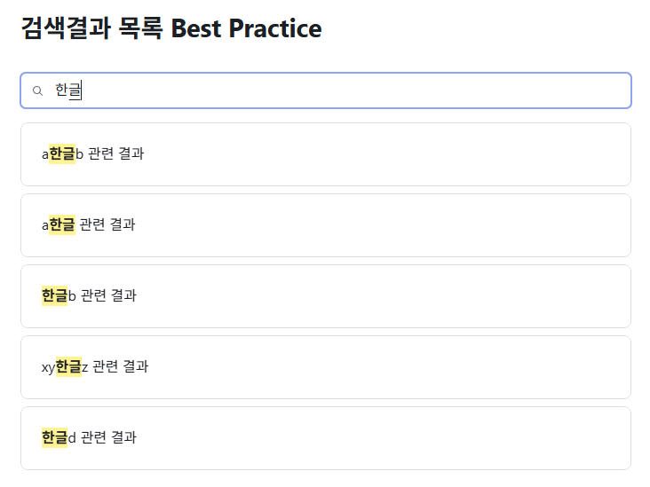
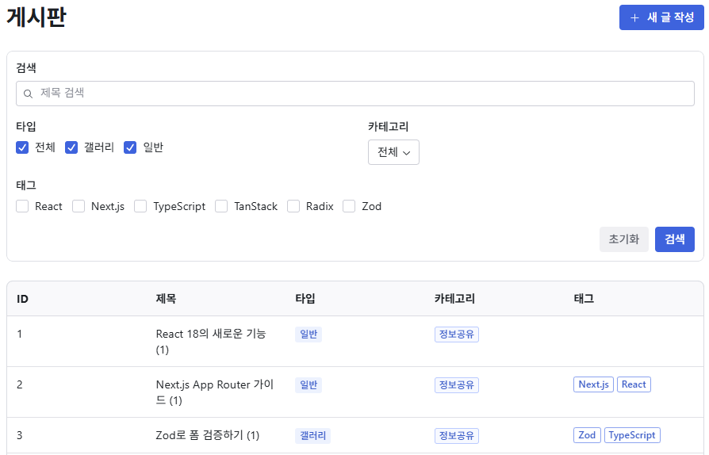
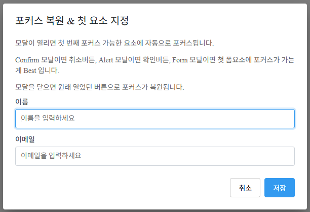

# Monorepo Playground

React/Next.js 실무 패턴을 모노레포로 구현한 프로젝트입니다.
제가 실무에서 반복적으로 마주치는 문제들을 어떻게 해결하는지 보여드립니다.

## 라이브 데모

구현된 패턴을 직접 확인할 수 있습니다:

- **Examples 앱** — [monorepo-playground-examples.vercel.app](https://monorepo-playground-examples.vercel.app/)
- **디자인 시스템 Storybook** — [design-system-eta-six.vercel.app](https://design-system-eta-six.vercel.app/)

## 정적 분석으로 코드 품질 자동화 — [PR #11](https://github.com/developer-choi/monorepo-playground/pull/11)

AI가 생성한 코드든 사람이 작성한 코드든, 리뷰어가 모든 실수를 눈으로 잡을 수는 없습니다.
제가 이 프로젝트에서 선택한 방법은 **커밋 시점에 자동으로 차단하는 것**입니다.

19개 이상의 커스텀 린트 룰을 적용했습니다.
예를 들어, 아래와 같은 코드는 커밋 자체가 불가능합니다:

```typescript
// ❌ await 없이 Promise 호출 — 에러가 조용히 삼켜집니다
fetchData();

// ❌ || 대신 ?? 를 강제 — 0이나 빈 문자열이 의도치 않게 무시됩니다
const value = input || 'default';

// ❌ switch에서 케이스 누락 — 유니온 타입에 새 값이 추가되면 컴파일 타임에 잡습니다
switch (status) {
  case 'active': return handleActive();
  // 'inactive' 케이스 누락 → 에러
}
```

검증은 2단계로 나뉩니다.
커밋할 때는 변경된 파일만 빠르게 검사하고, push할 때 전체 코드를 대상으로 검사합니다.
**커밋 속도와 코드 안전성을 모두 확보하는 구조입니다.**

## 검색 결과 UX 최적화 — [PR #3](https://github.com/developer-choi/monorepo-playground/pull/3)

검색 결과 페이지에서 흔히 사용하는 로딩 스피너는 체감 속도를 떨어뜨립니다.
제가 구현한 방식은 **이전 결과를 유지하면서 새 결과로 자연스럽게 전환**하는 것입니다.

직접 확인해 보세요 — [검색 결과 데모](https://monorepo-playground-examples.vercel.app/rendering/search-result/search)



```tsx
const [query, setQuery] = useState('');
const deferredQuery = useDeferredValue(query);

// 입력은 즉시 반영, 검색 결과 렌더링은 우선순위를 낮춤
<TextField value={query} onChange={e => setQuery(e.target.value)} />
<SearchResults query={deferredQuery} />
```

입력창의 반응성을 유지하면서, 이미 검색한 결과는 캐싱으로 즉시 표시됩니다.
대량의 결과는 가상 스크롤링으로 화면에 보이는 항목만 렌더링하여 성능을 확보했습니다.

## Zod 활용기

타입 선언, 유효성 검증, 에러 메시지를 각각 따로 작성하면 불일치가 발생합니다.
제가 사용하는 방식은 **스키마 하나를 단일 소스로 사용**하고, 여기서 모든 것을 파생하는 것입니다.

직접 확인해 보세요 — [유효성 검증 데모](https://monorepo-playground-examples.vercel.app/validation/integration)



하나의 원본 스키마에서 목록/상세/생성/수정/필터용 타입을 파생합니다.
같은 스키마가 폼 검증과 URL 검증에 동시에 사용되므로, 검증 로직을 중복 작성할 필요가 없습니다.

```typescript
// 스키마 하나로 타입 + 검증 + 에러 메시지를 통합합니다
const LessonSchema = z.object({
  title: z.string().min(1).max(LESSON_LIMITS.title.max),
  lessonType: z.enum(LESSON_TYPES.values),
});

// 폼 — 같은 스키마로 검증
useForm<z.infer<typeof LessonSchema>>({ resolver: zodResolver(LessonSchema) });

// URL 쿼리스트링 — 같은 스키마로 검증
const { success, data: filter } = LessonSchema.safeParse(searchParams);
```

enum 값과 한글 라벨도 하나의 배열로 관리합니다.
드롭다운 항목 순회, 테이블의 라벨 표시, 스키마의 값 목록까지 한 곳에서 파생됩니다.

```typescript
const LESSON_TYPES = createLabelMap([
  { value: 'online', label: '온라인' },
  { value: 'offline', label: '오프라인' },
]);

LESSON_TYPES.items;   // 순회 — 드롭다운, 라디오 버튼
LESSON_TYPES.record;  // 조회 — 테이블 라벨 표시
LESSON_TYPES.values;  // 스키마 — 유효성 검증
```

**상수, 제약 조건, 라벨을 한 곳에서 바꾸면 타입, 검증, 에러 메시지, UI까지 자동으로 반영됩니다.**

## 디자인 시스템 — [PR #2](https://github.com/developer-choi/monorepo-playground/pull/2)

Storybook 기반의 컴포넌트 라이브러리입니다.
직접 확인해 보세요 — [Storybook](https://design-system-eta-six.vercel.app/)



Material Design을 표준으로 삼아 컴포넌트 스펙을 정의했습니다.
MUI 원본 코드를 분석하여 확장 가능한 계층 구조를 설계했습니다.

예를 들어 Dialog, Bottom Sheet, Drawer가 공유하는 공통 동작(배경 딤, 포커스 잠금, 포탈)을 하나의 Modal 컴포넌트로 추상화하여 중복을 제거했습니다.
추상화 범위는 디자이너와 논의하여 실제로 필요한 것만 진행했습니다.

구축 과정은 [디자인 시스템 구축기](https://developer-choi.vercel.app/engineering/design-system)에서 확인할 수 있습니다.
