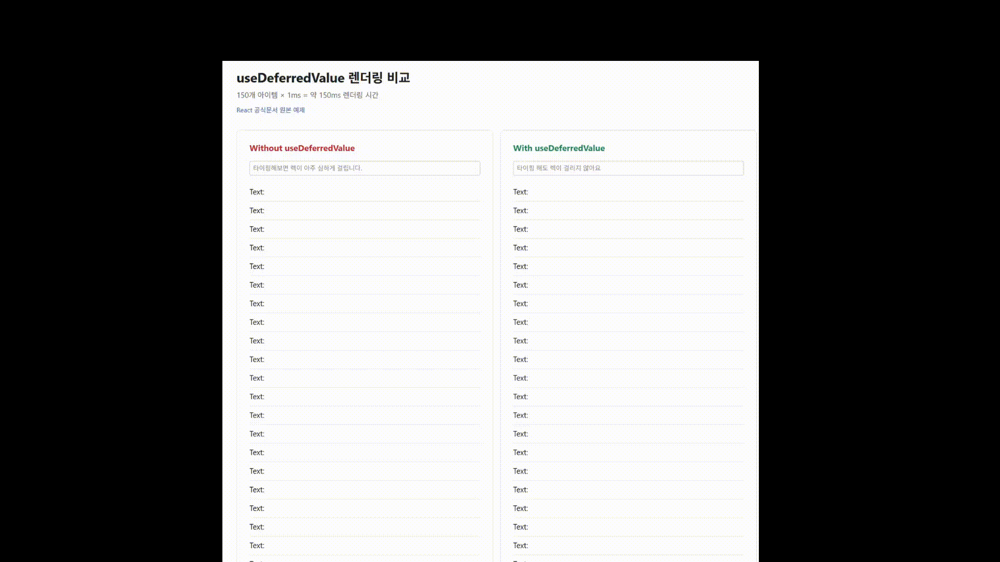
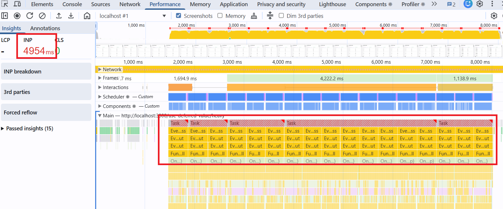
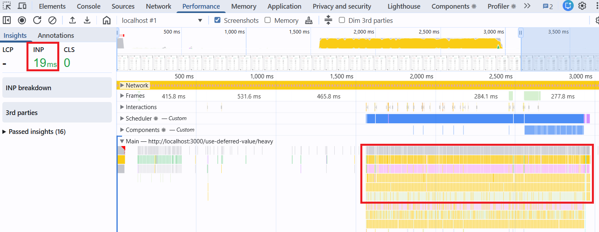

# 최고의 검색결과 목록이란 무엇인가

## 관련 자료
- [PR 링크](https://github.com/developer-choi/monorepo-playground/pull/3)
  - [useDeferredValue 비교 예제](https://monorepo-playground-examples.vercel.app/rendering/search-result/heavy)
  - [검색결과 목록 Best Practice](https://monorepo-playground-examples.vercel.app/rendering/search-result/search)
- [useDeferredValue() 학습자료](https://github.com/developer-choi/knowledge-archive/blob/main/knowledge/frontend/react/performance/use-deferred-value.md)

## UX 목표

1. 사용자의 타이핑은 검색폼에 빠르게 반영되어야 합니다.
2. 검색 결과도 빠르게 나타나야 합니다.
    - 로딩 스피너는 노출하지 않습니다.
    - 새로운 결과를 불러오는 동안에는 로딩 대신 기존 데이터를 유지하여 화면 깜빡임을 일으키지 않습니다.

### 구체적인 동작 예시

1. 사용자가 'a'를 입력하는 즉시 검색폼에 'a'가 표시되어야 합니다.
2. 로딩 스피너 없이 'a형 독감', 'AI'와 같은 관련 키워드가 빠르게 리스트업되어야 합니다.
3. 이후 'b'를 추가 입력하여 'ab'가 되는 경우:
    - 새로운 결과를 가져오는 동안 기존 'a'에 대한 검색 결과를 유지합니다.
    - 'ab'에 대한 결과가 준비되면 즉시 화면을 갱신합니다.
4. 다시 'b'를 지워 'a'만 남은 경우:
    - 'a'의 검색 결과를 빠르게 다시 노출해야 합니다.

### 왜 로딩 스피너를 지양해야 하는가?

로딩 스피너나 스켈레톤 UI는 근본적으로 데이터 로딩이 느릴 때 사용자가 체감하는 대기 시간을 줄이기 위한 **차선책**입니다.

화면이 깜빡이는 듯한 부정적인 사용자 경험을 유발할 수 있습니다.

시스템 응답이 빠르다면, 기존 데이터를 유지하다가 새로운 데이터로 즉시 교체하는 방식이 더 자연스러운 경험을 제공합니다.

## 핵심 구현 기술

1. **API 호출 최적화**: 입력 시마다 호출 vs 입력 완료 후 호출(Debouncing)
2. **캐싱**: 이전 검색 결과를 저장 후 Backspace 입력 시('abcd' → 'abc') 네트워크 요청 없이 즉시 데이터를 표시
3. **렌더링 지연**: 검색폼 반응이 제일 빠르도록 검색 결과 목록 렌더링을 미루기

### API 호출 전략

사용자 입력('a' → 'b' → 'c') 시점에 따른 두 가지 전략이 있습니다.

1. **입력 완료 후 호출**: 'abc' 입력이 완료된 시점에 한 번만 API를 호출합니다. (Debouncing 적용)
2. **입력 시마다 호출**: 'a', 'ab', 'abc' 각 입력 단계마다 즉시 API를 호출합니다. (네이버 방식)

첫 번째 방식은 불필요한 API 호출을 줄여 서버 부하를 낮출 수 있으나, Debouncing 지연 시간만큼 화면 반응 속도가 느립니다.

두 번째 방식은 입력과 동시에 요청을 보내므로 화면 반응이 가장 빠르지만, 그만큼 서버 부하가 증가합니다.

결국 **서버 부하**와 **사용자 경험(반응 속도)** 사이의 균형을 고려하여 전략을 선택해야 합니다.

### 캐싱

Tanstack Query 등의 라이브러리를 활용하면, 캐싱 기능을 손쉽게 구현할 수 있습니다.

### 렌더링 지연

`useDeferredValue`를 사용하면 검색폼 렌더링을 우선 처리하고, 목록 렌더링은 뒤로 미룰 수 있습니다.

### 성능비교

[useDeferredValue 비교 예제](https://monorepo-playground-examples.vercel.app/rendering/search-result/heavy)



Chrome DevTools > Performance 탭에서 측정한 결과입니다.





#### useDeferredValue X

메인 스레드에 긴 막대가 하나로 뭉쳐있음 = 그 시간 동안 입력 처리 불가

#### useDeferredValue O

메인 스레드에 짧은 막대가 촘촘하게 분산됨 = 중간중간 입력 처리 가능

#### 해석

긴 막대 하나가 뭉쳐있으면 그 시간 동안 브라우저가 다른 작업을 처리할 수 없습니다. 반면 짧은 막대가 촘촘하게 분산되어 있으면 중간중간 틈이 생겨 사용자 입력 같은 긴급한 작업을 먼저 처리할 수 있습니다.

`useDeferredValue`는 긴급한 업데이트(타이핑)에 높은 우선순위를 주고, 무거운 컴포넌트의 리렌더링을 나중으로 미룹니다.

## 기술 원리 탐구

### 디바운싱은 내부적으로 어떻길래 API 호출 횟수를 지연시킬 수 있을까요?

```typescript
// 핵심 원리: 마지막 호출 이후 일정 시간이 지나야 실행
function debounce(fn, delay) {
  let timeoutId;
  return (...args) => {
    clearTimeout(timeoutId);  // 이전 타이머 취소
    timeoutId = setTimeout(() => fn(...args), delay);  // 새 타이머 설정
  };
}
```

**동작 흐름:**
1. 사용자가 'a' 입력 → 300ms 타이머 시작
2. 100ms 후 'b' 입력 → 이전 타이머 취소, 새 300ms 타이머 시작
3. 100ms 후 'c' 입력 → 이전 타이머 취소, 새 300ms 타이머 시작
4. 300ms 경과 → 'abc'로 API 호출

**결과:** 타이핑이 끝난 후 300ms 뒤에 1번만 호출

### useDeferredValue는 어떻게 동작하길래 렌더링을 지연시킬 수 있을까요?

```typescript jsx
const [query, setQuery] = useState('');
const deferredQuery = useDeferredValue(query);

// query는 즉시 바뀜 → 검색폼에 바로 반영
<input value={query} onChange={e => setQuery(e.target.value)}/>

// deferredQuery는 긴급 렌더링 끝날 때까지 이전 값 유지 → memo된 컴포넌트는 리렌더링 스킵
<SearchResult query={deferredQuery}/>  // memo 필수
```

**동작 흐름:**
1. `setQuery('abc')` → 렌더링 2번 스케줄링 (긴급 + 지연)
2. 긴급: `query = 'abc'` 반영, `deferredQuery`는 아직 이전 값 → 검색폼만 업데이트
3. 지연: `deferredQuery = 'abc'` 반영 → 리스트 업데이트 (타이핑 중이면 중단됨)

### 흔한 오해

**useDeferredValue를 쓰면 API 호출 횟수가 줄어드나요?**

**아니요.** 네트워크 요청은 그대로 발생합니다. 지연되는 건 렌더링뿐입니다.

> [useDeferredValue does not by itself prevent extra network requests.](https://react.dev/reference/react/useDeferredValue#caveats)

**useDeferredValue를 쓰면 렌더링이 빨라지나요?**

**아니요.** 렌더링 속도 자체는 그대로입니다. 우선순위만 조절합니다.

> [This does not make re-rendering of the SlowList faster. However, it tells React that re-rendering the list can be deprioritized so that it doesn’t block the keystrokes.](https://react.dev/reference/react/useDeferredValue#deferring-re-rendering-for-a-part-of-the-ui)

**그럼 useDeferredValue를 왜 쓰나요?**

검색폼과 검색결과 목록 중 검색폼 렌더링을 우선시하기 위해서입니다.

사용자 디바이스 성능이 좋지 않아 "키보드 입력 즉시 반영" vs "검색결과 목록 렌더링" 중 하나만 선택해야 하는 상황이라면, 키보드 입력이 바로 화면에 반영되는 것이 더 중요하다고 생각합니다.

**검색결과 목록은 렌더링 비용이 크지 않은데, 굳이 써야 하나요?**

사용자 디바이스가 좋다면 useDeferredValue도 지연 없이 동작하므로, 안 쓴 것과 동일합니다.

정리하면, 디바이스가 좋으면 영향 없고 나쁘면 개선해주므로, 안 써야 할 이유는 약간의 코드 복잡성 증가 외에는 없다고 생각합니다.

> - [How is deferring a value different from debouncing and throttling?](https://react.dev/reference/react/useDeferredValue#how-is-deferring-a-value-different-from-debouncing-and-throttling)
> - useDeferredValue is better suited to optimizing rendering because it is deeply integrated with React itself and adapts to the user’s device.
> - If the user’s device is fast (e.g. powerful laptop), the deferred re-render would happen almost immediately and wouldn’t be noticeable.
> - If the user’s device is slow, the list would “lag behind” the input proportionally to how slow the device is.

## 학습한 내용

### 검색결과 목록 UX
- API 호출 빈도(서버 부하) vs 화면 반응 속도 트레이드오프
- 로딩 스피너보다 이전 데이터 유지가 더 자연스러운 UX

### 디바운싱 vs useDeferredValue
- **디바운싱**: API 호출 빈도 감소 (네트워크 최적화)
- **useDeferredValue**: 렌더링 우선순위 조절 (UI 최적화)
- 서로 다른 문제를 해결하며, 함께 사용 가능

### useDeferredValue 핵심 정리
- API 호출 횟수를 줄이지 **않음** (렌더링만 지연)
- 렌더링 속도를 빠르게 하지 **않음** (우선순위만 조절)
- 고정된 delay 없음 (디바이스 성능에 따라 적응)
- `memo`와 함께 써야 효과 있음
- 렌더링 중 긴급 업데이트 오면 **중단 가능** (디바운싱과의 핵심 차이)


## 함께 챙겨야 하는 UX

### 검색어 하이라이트

사용자가 입력한 검색어가 결과 목록의 어느 부분과 일치하는지 시각적으로 강조해야 합니다. 일치하는 부분을 빠르게 인지할 수 있어 검색 효율이 높아집니다.

### 에러 처리

API 호출이 실패할 수 있습니다. 에러 발생 시 사용자에게 명확한 피드백과 재시도 옵션을 제공해야 합니다. React의 ErrorBoundary를 활용하면 선언적으로 에러 UI를 처리할 수 있습니다.

### Race Condition 방지

네트워크는 요청 순서대로 응답이 오지 않을 수 있습니다. '가' 요청보다 '가나' 요청의 응답이 먼저 도착하면, 사용자는 '가나'를 입력했는데 '가'의 결과를 보게 됩니다.

React Query는 내부적으로 이를 처리하여 항상 최신 요청의 결과만 반영합니다.  