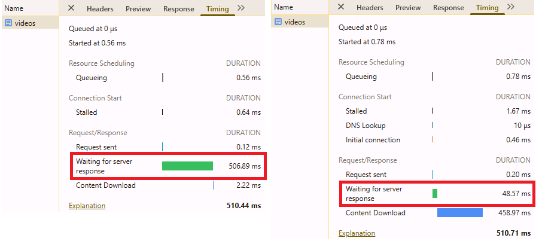
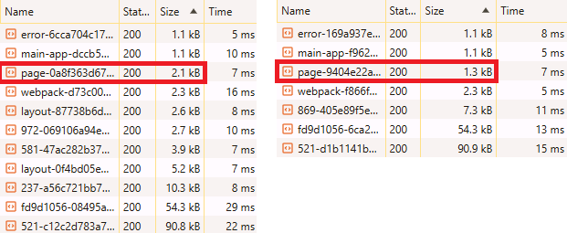
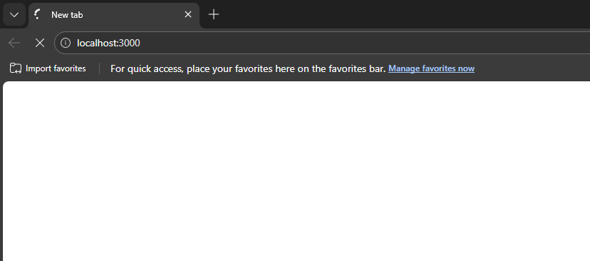

# App Router Streaming으로 TTFB 개선

> 이 문서의 성과 수치(TTFB 39%·번들 48% 감소)와 TTFB·번들 비교 이미지는 이전 회사 프로덕션에서 측정·달성한 값입니다. 본 가이드는 그때 적용한 렌더링 전략을 이 레포의 예제(`apps/examples`의 게시글 목록)로 **재현**했으며, 네트워크 워터폴·타이밍 캡처는 그 재현 예제에서 얻었습니다.

## 1. 문제 정의: 사용자가 멈칫하는 0.6초의 공백
대부분의 페이지 이동 시 평균 **0.6초**의 지연이 발생했습니다.

이는 사용자가 "내가 링크를 제대로 눌렀나?"라고 의심하게 만드는 시간입니다.

분석 결과, **백엔드 API 응답 대기 시간이 평균 약 0.3초 정도** 걸렸습니다.

즉, 데이터가 준비될 때까지 화면 전환이 차단되는 것이 문제였습니다.

좌측은 잘못된 방식의 SSR로 인해 백엔드 API 응답 시간만큼 TTFB가 지연된 모습이며,

우측은 Streaming을 도입하여 이를 개선한 결과입니다.

## 2. 해결 전략: Blocking 해결을 위한 렌더링 방식 변경
백엔드 응답 속도를 당장 개선할 수 없는 상황에서, 사용자의 체감 속도(INP)를 높이기 위해

로딩을 먼저 보여주는 전략을 세웠습니다.

CSR에서 출발해 SSR Prefetch, Streaming으로 단계적으로 개선하며 각 방식의 한계를 발견하고 넘어섰습니다.

### CSR — 출발점과 한계

가장 단순한 출발점은 CSR입니다. 하지만 클라이언트에서 데이터를 fetch하므로 HTML → JS 다운로드 → API 호출의 waterfall이 생기고, 데이터 Fetching 로직과 Client Component만큼 클라이언트 번들도 커집니다.

좌측은 CSR 방식을 적용한 화면이며,

우측은 서버에서 데이터를 페칭한 화면입니다.

대부분의 페이지는 사용자의 상호작용보다는 데이터 조회가 주된 목적이었습니다.

따라서 **번들 사이즈**를 늘리면서까지 CSR을 도입할 이유는 없었고, 서버에서 데이터를 가져오는 방식으로 넘어갔습니다.

### SSR Prefetch — waterfall 제거, 그러나 Blocking

서버에서 첫 페이지 데이터를 prefetch해 HTML에 포함시키면 CSR의 waterfall이 사라집니다.

| CSR (useQuery) | SSR (prefetch) |
|---|---|
|  |  |

[SSR prefetch 커밋](https://github.com/developer-choi/monorepo-playground/pull/6/changes/e7417882501978fa6365cf3342798eb92aface2f)을 통해 개선한 내역은 다음과 같습니다.

1. **API waterfall 제거**: CSR에서는 HTML → JS 다운로드 → `board` API 호출 순서로 3단계 waterfall이 발생했으나, 서버에서 데이터를 prefetch하여 클라이언트의 API 호출을 제거했습니다.
2. **이미지 로딩 시점 앞당김**: CSR에서는 API 응답 이후에야 이미지 URL을 알 수 있었으나, SSR에서는 HTML에 `` 태그가 포함되어 파싱 즉시 이미지 다운로드가 시작됩니다.
3. **초기 렌더링 콘텐츠 제공**: CSR의 HTML은 빈 껍데기였으나, SSR은 게시글 목록이 포함된 HTML을 내려보내 JS 실행 전에도 콘텐츠가 표시됩니다.

하지만 SSR prefetch에는 새로운 한계가 있습니다. API 응답이 느려지면 서버가 HTML 전체를 블로킹하여, 사용자에게 아무것도 보이지 않는 빈 화면이 노출됩니다.

### Streaming — Blocking 해결

앞의 Blocking을 검증하기 위해 [API에 1초 딜레이를 추가한 커밋](https://github.com/developer-choi/monorepo-playground/pull/6/changes/6d7eb197d954f52d941b5b7ceea09b44e6cf0a9e)으로 문제를 재현하고, [Streaming 커밋](https://github.com/developer-choi/monorepo-playground/pull/6/changes/2c1339017a484449337b26a3073090906d60b124)을 통해 개선했습니다.

#### 사용자 화면 비교

| SSR Blocking (Suspense 없음) | Streaming (Suspense 적용) |
|---|---|
|  |  |

- **SSR Blocking**: API 응답까지 1초간 완전한 빈 화면이 노출됩니다. 사용자는 페이지가 고장났다고 느낍니다.
- **Streaming**: 서버가 헤더 + 스켈레톤을 즉시 전송하고, API 응답이 완료되면 실제 콘텐츠를 스트리밍합니다.

#### Network Waterfall 비교

| SSR Blocking | Streaming |
|---|---|
|  |  |

- **SSR Blocking**: HTML 문서 응답 자체가 1.16s로, 그 동안 CSS/JS/이미지 등 모든 리소스가 대기합니다.
- **Streaming**: CSS와 이미지가 즉시 로딩을 시작합니다.

#### Timing 상세 비교

| | SSR Blocking | Streaming |
|---|---|---|
| Waiting for server response | **1.04s** (서버가 API 응답을 기다리며 블로킹) | **10.87ms** |
| Content Download | 5.20ms | **1.01s** (점진적 스트리밍) |

같은 1초 API 딜레이에서, Blocking은 서버가 응답 자체를 1초간 보류하는 반면 Streaming은 즉시 응답을 시작하고 Content Download 단계에서 데이터를 점진적으로 내려보냅니다.

### Pages Router와의 비교

Pages Router 시절에는 Streaming이 지원되지 않아, API 응답이 느릴 경우 빈 화면을 피하기 위해 SSR 대신 CSR로 돌려 로딩 UI라도 빨리 보여주는 것이 일반적이었습니다. App Router에서는 Suspense 기반 Streaming이 내장되어 있어 SSR의 이점을 유지하면서도 블로킹 없이 즉시 셸을 내려보낼 수 있으므로, 더 이상 그런 트레이드오프가 필요하지 않습니다.

## 3. 적용 성과
다음은 이전 회사 프로덕션에서 측정·달성한 값입니다.

* **체감 속도 개선:** 페이지 이동 시간 `545ms` → **`333ms` (39% 단축)**
* **네트워크 비용 절감:** 클라이언트 번들 사이즈 `10.7kB` → **`5.5kB` (48% 감소)**
* **생산성:** 패턴 정립 후 10여 개 페이지에 적용하는 데 **30분 미만** 소요

## 4. 근거 자료
이러한 기술적 판단은 공식 문서를 분석한 결과에 기반했습니다.

> [To reduce the size of your client JavaScript bundles, add 'use client' to specific interactive components (Nextjs docs)](https://nextjs.org/docs/app/getting-started/server-and-client-components#reducing-js-bundle-size)

> [To improve the initial load time and user experience, you can use streaming (Nextjs Docs)](https://nextjs.org/docs/app/getting-started/fetching-data#streaming)

## 5. 향후 고도화 계획: Partial Prerendering (PPR)
현재 방식에도 아직 아쉬움이 남아있습니다.

### 한계

> [During rendering, if a dynamic function or uncached data request is discovered, Next.js will switch to dynamically rendering the whole route. (Nextjs docs)](https://nextjs.org/docs/14/app/building-your-application/rendering/server-components#switching-to-dynamic-rendering)

> [In most websites, routes are not fully static or fully dynamic (Nextjs docs)](https://nextjs.org/docs/14/app/building-your-application/rendering/server-components#dynamic-rendering)

공식 문서의 설명처럼 대부분의 웹사이트는 정적/동적 요소가 혼재되어 있습니다. 하지만 현재는 `cookies()`와 같은 동적 함수를 하나만 사용해도 **페이지 전체가 Full Route Cache(Static Build) 대상에서 제외되는 한계**가 있습니다.

### 기대
향후 [Partial Prerendering](https://nextjs.org/docs/15/app/getting-started/partial-prerendering) 기능이 Stable 단계로 도입되기를 기대하고 있습니다.

> [to combine static and dynamic content in the same route. This improves the initial page (Nextjs docs)](https://nextjs.org/docs/15/app/getting-started/partial-prerendering)

---

# 회고

**이 기술이 다른 상황에서도 최선일까?** 라는 질문을 던지며 기술 선택의 기준을 재점검했습니다.

## 만약 Public 서비스를 구현해야 한다면? > Data Cache와 Full Route Cache를 활용하자
이번 프로젝트는 사용자마다 다른 데이터가 보이는 **private 페이지**였기에, Data Cache, Full Route Cache는 사용할 수 없었습니다.

하지만 모든 사용자에게 동일한 정보를 제공하는 **Public 페이지** 라면 전략이 달라져야 합니다.

### 문제 상황
10만 명의 사용자가 Public 페이지에 동시 접속할 경우, 백엔드 API도 10만 번 호출하게 되어 부하가 가중됩니다.

### 해결 전략: 캐싱 활용
1. **Data Cache:** 백엔드 응답 데이터만 캐싱하여 API 호출 횟수 줄이기
2. **Full Route Cache:** 렌더링 결과물까지 캐싱

이러한 전략을 통해 10만 명이 동시에 접근해도 백엔드 API는 **단 1회**만 호출되도록 최적화할 수 있습니다.

### 실제 적용 예시
**perf(cache): 채널 정보 API에 5분 단위 Time-based Revalidation 적용**

* 유튜브 채널 정보는 모든 사용자에게 동일하게 보이는 정적 데이터입니다.
* 이 정보가 최신화되야하는 시점은 '관리자가 채널정보를 수정할 때'와 '구독자 수가 늘어날 때'입니다.
* 구독자 수의 실시간 갱신 대신, n분의 지연이 발생해도 괜찮은지 기획팀과 논의하겠습니다.

## TanStack Query는 여전히 유효한가?
Server Component의 도입으로 데이터 페칭이 서버로 넘어갔지만, 여전히 클라이언트 페칭도 부분적으로 유효함을 확인했습니다.

1.  **Infinite Scroll:** 스크롤 이벤트를 통해 데이터를 추가로 로드하는 경우.
2.  **Background Refetching:** `window focus` 시 최신 데이터로 갱신하는 경우.

브라우저에서 발생하는 사용자 이벤트는 물리적으로 서버가 처리할 수 없는 영역입니다.

## 출처
이러한 기술적 판단은 공식 문서를 분석한 결과에 기반했습니다.

> [Next.js has a built-in Data Cache that persists the result of data fetches across incoming server requests and deployments. (Nextjs docs)](https://nextjs.org/docs/14/app/building-your-application/caching#data-cache)

> [In Next.js, you can have dynamically rendered routes that have both cached and uncached data. (Nextjs docs)](https://nextjs.org/docs/14/app/building-your-application/rendering/server-components#dynamic-rendering)

> To understand if your application can benefit from React Query when also using Server Components, see the article [You Might Not Need React Query.](https://tkdodo.eu/blog/you-might-not-need-react-query)

# 다른 해결 방법은 없었는가?

성능 개선에는 렌더링 전략 외에도 다양한 방법이 존재합니다.

웹 페이지가 브라우저에 전달되어 리소스를 다운로드하고 그려지는 전체 과정을 모두 개선한다면,

이론상 가장 빠른 웹 페이지를 만들 수 있을 것입니다.

현재는 그 다양한 방법들 중 하나의 마일스톤을 달성한 상태입니다.

앞으로는 렌더링 단계를 넘어, 성능 개선의 전체적인 관점에서 최적화해 나가는 엔지니어가 되고 싶습니다.
